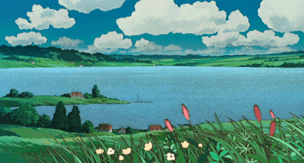

  

<h1 align="center">
  Hi  I'm Samantha Lorin
</h1>

  3rd Year Computer Science Student • Major in Machine Learning

---

* ⚡ Currently focusing on: JAVA & Python
* ✉️  You can contact me at [hidalgosamanthalorin@gmail.com](mailto:hidalgosamanthalorin@gmail.com)

### 🌿 Skills

  

  

---
### Socials

 <a href="https://www.github.com/SamanthaLorin" target="_blank" rel="noreferrer"> <picture> <source media="(prefers-color-scheme: dark)" srcset="https://raw.githubusercontent.com/danielcranney/readme-generator/main/public/icons/socials/github-dark.svg" /> <source media="(prefers-color-scheme: light)" srcset="https://raw.githubusercontent.com/danielcranney/readme-generator/main/public/icons/socials/github.svg" />  </picture> </a> <a href="https://www.facebook.com/samanthalorinhidalgo222/" target="_blank" rel="noreferrer"> <picture> <source media="(prefers-color-scheme: dark)" srcset="https://raw.githubusercontent.com/danielcranney/readme-generator/main/public/icons/socials/facebook-dark.svg" /> <source media="(prefers-color-scheme: light)" srcset="https://raw.githubusercontent.com/danielcranney/readme-generator/main/public/icons/socials/facebook.svg" />  </picture> </a>

  

